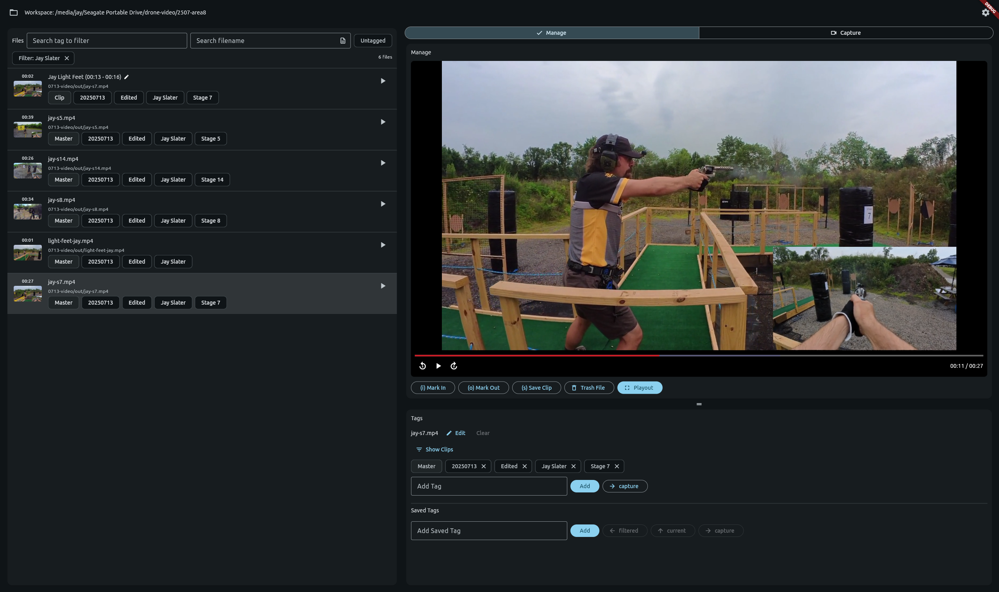

# Clipshow



**Clipshow** is a desktop Flutter app for managing, tagging, and playing video clip libraries for live streams and broadcasts. Everything lives in a **workspace** folder on disk: media files plus a local SQLite database (`obs_clipshow.db`) for tags, non-destructive clip ranges, and settings.

Use the dashboard to search, filter, create **clips** (in/out marks on a master file), and prepare material. **Manage** mode is for library work; **Capture** drives OBS recording into the workspace when you want new takes ingested automatically. The **Tag Sets** tab holds video-less tag bundles for data-driven **on-screen graphics**. **Playout** is a dedicated 16∶9 broadcast-style player for sending a master or clip to air—optionally switching OBS **program** scenes over WebSocket and firing **HTTP webhooks** on enter and exit. **On-screen graphics** overlay template artwork and semantic tag text in preview and playout; **OSG Mode** is a separate transparent graphics surface for live overlays without video. **Bake** renders clips with graphics composited into a shareable file; **Record** captures OBS program output during playout in real time. An on-screen **telestrator** draws over the picture during playout for commentary.

## Features

- Workspace-scoped library with background ingestion (common container formats under configurable ignored paths).
- File list with tag and text search, clip editing and bulk tagging.
- On-screen graphics with semantic tags; preview and playout toggles and a workspace editor.
- Tag Sets and OSG Mode for graphics-only live output (optional OBS overlay source toggle).
- Playout with keyboard-driven seek help, end-of-file pause, telestrator (colors, brush, undo), and OSG preset hotkeys.
- Bake queue for offline clips with composited graphics; bake recipes in workspace settings.
- Record playout export via OBS (program capture, separate from Capture ingest).
- Optional OBS WebSocket integration: scene switches during playout and capture; OSG Mode overlay source enable/disable; recording path staging with copy-to-output ingest workflow.
- Optional webhooks with fixed `video`, `face`, `osg_on`, and `osg_off` tokens for companion automation.
- Workspace settings: telestrator defaults, decoder tuning, OBS and webhook profiles, capture and export paths, JSON metadata export.

## Requirements

- **Flutter** (see `pubspec.yaml` for the SDK constraint).
- **Desktop:** Linux and Windows are the current targets for this repository; building for other platforms may require extra validation.
- **FFmpeg:** `ffmpeg` and `ffprobe` on your `PATH` for thumbnails, duration probing, and bake export—install via your OS package manager or [winget](https://winget.run/pkg/Gyan/FFmpeg) on Windows (`Gyan.FFmpeg`). Details are in [MANUAL.md](MANUAL.md) §2.2.
- **OBS Studio** when you use capture, scene switching, OSG Mode overlay automation, or record playout (WebSocket, typically port 4455).

## Run from source

From a checkout of this repository:

```bash
flutter pub get
flutter run -d linux    # or -d windows
```

Release builds follow the usual Flutter workflow for your target OS (`flutter build linux`, `flutter build windows`, etc.).

## Documentation

| Doc | Purpose |
| --- | --- |
| [MANUAL.md](MANUAL.md) | End-user manual (workspaces, dashboard, capture, playout, settings, export, troubleshooting). |
| [SPEC.md](SPEC.md) | Product specification and architecture notes for contributors. |

## Contributing

Use `dart analyze` (and your usual Flutter tests) before opening a pull request. Bugfixes should have tests where feasible. UI and behavior changes should update MANUAL.md; architecture or state-machine changes should update SPEC.md.
